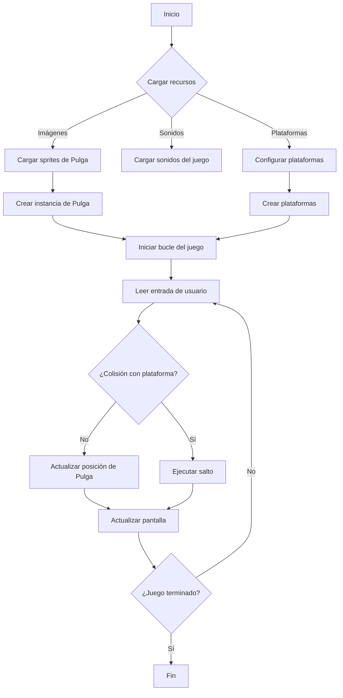
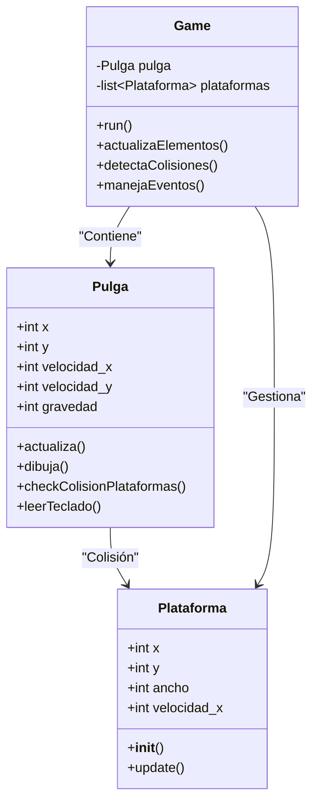
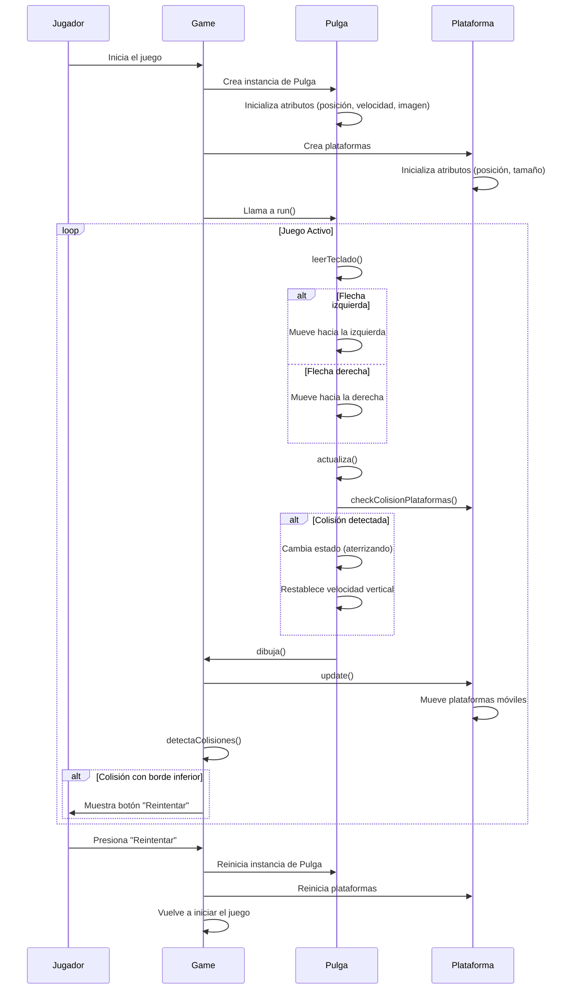

# Juego Pulga

Este es un juego sencillo desarrollado en Python utilizando la biblioteca Pygame. El jugador controla a una pulga que salta entre plataformas, con el objetivo de superar la mayor cantidad posible de ellas.

## Estructura del Proyecto

El proyecto está organizado en varios archivos:

1. `main.py`: Contiene la lógica principal del juego, las reglas, el bucle principal, y la gestión de eventos.
2. `pulga2.py`: Define las clases `Pulga` y `Plataforma`, que gestionan el comportamiento del jugador (pulga) y las plataformas en el juego.
3. `assets/`: Carpeta que contiene los recursos gráficos y de sonido utilizados en el juego.
   - `img/`: Imágenes de fondo, plataformas, y sprites de la pulga.
   - `sound/`: Sonidos de salto y música de fondo.

### Detalles de los Archivos

#### `main.py` 

Este archivo es el corazón del juego. Gestiona las reglas del juego, el bucle principal, y las interacciones del jugador con el entorno. 

Las funciones clave incluyen:
- **`Game`**: Clase que maneja el estado del juego, la inicialización de Pygame, la creación de plataformas, y el sistema de scroll.
- **`buclePrincipal`**: El ciclo principal del juego, donde se procesan eventos, se actualizan los sprites y se dibuja en pantalla.
- **`update`**: Método encargado de actualizar el estado del juego en cada frame, gestionando el scroll, dibujando el fondo y los elementos del juego.
- **`check_event`**: Maneja los eventos como teclas pulsadas o clics del ratón, e incluye la lógica para reiniciar el juego si es necesario.
- **`dibujar_boton_reintentar`**: Dibuja un botón de "Reintentar" cuando el jugador pierde, permitiendo reiniciar el juego con un clic.

#### `pulga2.py` 
Este archivo contiene las clases `Pulga` y `Plataforma`, responsables del comportamiento de los personajes y objetos en el juego.

- **Clase Pulga**: Define las características del personaje principal (pulga).
  - **Movimiento**: La pulga puede moverse a izquierda y derecha, con saltos automáticos al aterrizar en plataformas.
  - **Colisiones**: Detecta si la pulga colisiona con una plataforma o cae fuera de la pantalla.
  - **Métodos importantes**:
    - `actualiza()`: Controla el comportamiento de la pulga en cada frame. Calcula la física del salto y caída, y actualiza la posición de la pulga en función de su velocidad.
    - `checkColisionPlataformas()`: Detecta las colisiones con plataformas y reinicia el salto cuando aterriza sobre una. Si la pulga colisiona con una plataforma por debajo de su centro, se ajusta su posición para evitar que atraviese la plataforma.
    - `leerTeclado()`: Permite que el jugador controle la pulga usando las teclas de flecha izquierda y derecha, actualizando su velocidad horizontal.

- **Clase Plataforma**: Maneja las plataformas en las que la pulga puede aterrizar.
  - **Plataformas estáticas y móviles**: Se crean con diferentes anchos y, en algunos casos, con movimiento horizontal.
  - **Métodos importantes**:
    - `update()`: Actualiza la posición de las plataformas y las elimina si salen de la pantalla. En el caso de las plataformas móviles, actualiza su posición según el movimiento configurado.
    - `dibujar()`: Dibuja la plataforma en la pantalla en su posición actual.

### Métricas de Tamaño

- **`main.py`**: 
  - **Tamaño**: ~205 líneas de código.
  - **Responsabilidades**: Lógica principal del juego, control de eventos, scroll, y bucle principal.

- **`pulga2.py`**:
  - **Tamaño**: ~178 líneas de código.
  - **Responsabilidades**: Manejo del comportamiento de la pulga y las plataformas (movimiento, colisiones, dibujo en pantalla).

## Cómo Ejecutar el Juego

Sigue estos pasos para ejecutar el juego:

1. Asegúrate de tener Python y Pygame instalados:
   ```bash
   pip install pygame
    ```
 ## Controles

- **Flecha izquierda**: Mueve la pulga hacia la izquierda.
- **Flecha derecha**: Mueve la pulga hacia la derecha.
- **Salto automático**: La pulga salta automáticamente cuando aterriza en una plataforma.

## Requisitos

- **Python 3.x**
- **Pygame**

## Recursos y Créditos

- Las imágenes de fondo y sprites se encuentran en la carpeta `assets/img/`.
- Los sonidos del juego (salto y música de fondo) están en `assets/sound/`.


## Diagrama de Flujo del Proyecto Pulga



## Diagrama de Clases



## Diagrama de Secuencia 



# Porcentaje de Módulos o Funciones Implementadas Correctamente

## Métrica
Porcentaje de módulos del sistema que funcionan correctamente según los requisitos.


## Ejemplo
Si se han implementado 100 módulos y 95 de ellos funcionan correctamente:

1. **Formula**:
    
    - Porcentaje de Modulos Correctos = (${Numero de modulos correctos} \over {Numero Total de modulos}$) x 100

2.  **Ejemplo**:
    - **Porcentaje de Modulos Correctos  
    (${95} \over {100}$) x 100 = 95%**
  

## Interpretación
- **Alto Porcentaje (95%):** Indica que la mayoría de los módulos están funcionando correctamente según los requisitos, lo cual es un excelente indicativo de calidad y cumplimiento en el desarrollo del juego "Pulga".
- **Impacto:** Este alto porcentaje sugiere que el sistema es robusto y que las funcionalidades clave han sido implementadas de manera efectiva, lo que mejora la experiencia del usuario y reduce la necesidad de revisiones posteriores.


# Tamaño de Código (LOC) para `main.py` y `pulga2.py`

### 1. Líneas de Código (LOC)

- `main.py`: **205 líneas**
- `pulga2.py`: **178 líneas**
  
**Total LOC = 383 líneas**

### 2. Fórmula:

**205 + 178 = 383**

### 3. Interpretación:
- **Alto LOC**: El código tiene un tamaño considerable, lo que podría reflejar una aplicación con varias funcionalidades. Es importante asegurarse de que esté bien modularizado y estructurado para facilitar su mantenimiento.
- **Bajo LOC en `pulga2.py`**: Podría reflejar una implementación más simple o especializada en una funcionalidad específica.

## Cohesión de Clase (LCOM)

1. **Cohesión de Clase (LCOM)**

2. **Fórmula**:
   
   `LCOM = Número de pares de métodos que no comparten atributos`

3. **Ejemplo**:

   - **Clase `Pulga`**: La clase tiene 8 métodos, de los cuales 4 no comparten atributos entre sí. El número total de pares de métodos en esta clase es 28.
     `LCOM = 4`

   - **Clase `Game`**: La clase tiene 10 métodos, de los cuales 3 no comparten atributos entre sí. El número total de pares de métodos en esta clase es 45.
     `LCOM = 3`

   - **Clase `Plataforma`**: La clase tiene 2 métodos, de los cuales 1 no comparte atributos entre sí. El número total de pares de métodos en esta clase es 1.
     `LCOM = 1`

4. **Interpretación**:

   - **Bajo LCOM**: Indica alta cohesión. La mayoría de los métodos están relacionados y operan sobre los mismos atributos, lo que sugiere que la clase tiene una única responsabilidad.
   
   - **Alto LCOM**: La clase puede estar asumiendo demasiadas responsabilidades. Considera refactorizar en clases más pequeñas con responsabilidades bien definidas.

